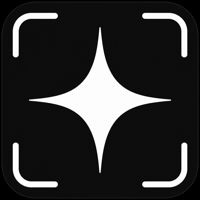

中文 | [English](README.md)

# Lumashot

<p align="center">
  
</p>

<p align="center">
  <b>支持真 HDR 截图的现代 macOS 截图工具。</b><br>
  <br>
  全局快捷键、干净工具栏、AppKit 原生实现 — 外加基于 ScreenCaptureKit 的真 HDR 截图导出（HEIC gain map）。<br>
  基于 macshot 分支，专注于现代显示器截图。
</p>

<p align="center">
  <a href="https://github.com/Zichao-xu/lumashot/releases/latest">下载</a> · <a href="https://github.com/Zichao-xu/lumashot/blob/main/CHANGELOG.md">更新日志</a> · <a href="https://github.com/Zichao-xu/lumashot/blob/main/PRIVACY.md">隐私</a>
</p>

---

### 为什么选择 Lumashot？

- **真 HDR 截图（HEIC gain map）** — 基于 ScreenCaptureKit 捕获，在 HDR 显示器上输出真正的 HDR 截图。不是伪 HDR —  genuine SDR base + HDR gain map。
- **原生 macOS 体验** — 全局快捷键、干净工具栏、AppKit 原生实现（非 Electron）。空闲时内存约 8 MB。
- **SDR/HDR 兼容工作流** — HDR 和标准的 PNG/JPEG/HEIC SDR 导出在同一条流程里。工具栏切换 HDR 按钮即可；Done 输出 HEIC，关闭则输出 PNG。
- **轻量标注工具** — 箭头、形状、文字、铅笔、马克笔、数字标记、像素化、测量、放大镜。
- **精致工具栏与动效** — macOS 风格动效、连续圆角、Liquid Glass 质感、动画过渡。
- **高度可定制** — 全局快捷键、文件格式、质量、剪贴板行为均可配置。

---

## 安装（本 fork）

> **注意：** 上游 macshot 拥有更完整的功能集（滚动截图、屏幕录制、视频编辑器、OCR、云上传）。Lumashot 是专注于现代显示器和 HDR 捕获的分支。

**从源码构建：**
```bash
git clone https://github.com/Zichao-xu/lumashot.git
cd lumashot
xcodebuild -scheme macshot -configuration Release
# 结果：Lumashot.app → 复制到 /Applications
```

或从 [Releases](https://github.com/Zichao-xu/lumashot/releases) 下载最新 alpha 版本。

**上游 macshot（推荐大多数用户）：**
```bash
brew install --cask macshot
```
或从 [sw33tLie/macshot releases](https://github.com/sw33tLie/macshot/releases) 下载。

---

## 快速开始

1. 启动 Lumashot — 它会出现在菜单栏中
2. 按 `Cmd+Shift+X` 开始截图
3. 拖选区域，使用工具栏标注，按 `Cmd+C` 复制
4. 按 `Esc` 取消

**HDR 模式：** 点击工具栏中的 `HDR` 按钮，然后点击 Done。截图将以 HDR 格式保存为带 gain map 的 HEIC 文件。

---

## 权限

Lumashot 需要**屏幕录制**权限。首次截图时 macOS 会自动提示授权。

---

## 系统要求

macOS 12.3（Monterey）或更高版本。HDR 截图需要 macOS 15（Sequoia）或更高版本，以及支持 HDR 的显示器。

## 许可证

[GPLv3](LICENSE)

*本项目基于 [sw33tLie/macshot](https://github.com/sw33tLie/macshot)。对原始作者的完整归属已被保留。*
